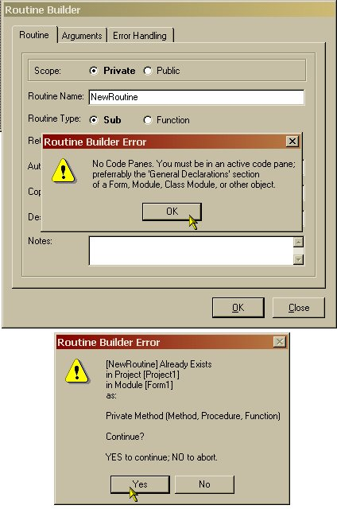



## Routine Builder v2\.0\.0\.8

### Description

Here's a lil' VB6 Subroutine and Function Builder Add-In that I did a few years ago. It actually began as a VB5 project and converted to VB6 almost as soon as VS6 hit the shelves. Just finished some minor updates. It's pretty robust and offers data/return type selection (will automatically select data/return types if you used standard prefixes for your arguments e.g. i; integer; obj; object, sng/sgl; single, etc.), optional argument + default value, error handling (On Error Resume Next, Goto Handler, Goto RoutineNameErr, Display or Raise + write to log file. The interface is locked down tight, too. As far as I can tell, no control is enabled or disabled before/after its time. Try it!

###

Okay... I've updated this thing. Someone emailed me to say that it doesn't work. I just added a check for available code panes. Should stop error 91 (Object variable or with block variable not set) when trying to use the Routine Builder against the Form editor or when there are no code panes open.

###

And yet another update. Version 2.0.0.8 now also checks all VBProjects and all VBComponents for routines, variables, constants, events, and properties of the same name. If one is found, is displays message to user which Project, Component, Member was found, plus Scope and Type of Member.
 
### More Info
 
Assumes you know how to build and work with VB add-ins.

Make sure you are in the General Declarations section of the Module you want your routine before clicking OK.

             |
---                |---
**Submitted On**   |2002-11-05 16:18:48
**By**             |[Kurt J\. Tischer](https://github.com/Planet-Source-Code/PSCIndex/blob/master/ByAuthor/kurt-j-tischer.md)
**Level**          |Advanced
**User Rating**    |5.0 (20 globes from 4 users)
**Compatibility**  |VB 6\.0
**Category**       |[VB function enhancement](https://github.com/Planet-Source-Code/PSCIndex/blob/master/ByCategory/vb-function-enhancement__1-25.md)
**World**          |[Visual Basic](https://github.com/Planet-Source-Code/PSCIndex/blob/master/ByWorld/visual-basic.md)
**Archive File**   |[Routine\_Bu1492481152002\.zip](https://github.com/Planet-Source-Code/kurt-j-tischer-routine-builder-v2-0-0-8__1-40345/archive/master.zip)

### API Declarations

Declare Function WritePrivateProfileString& Lib "kernel32" Alias "WritePrivateProfileStringA" (ByVal AppName$, ByVal KeyName$, ByVal keydefault$, ByVal FileName$)

